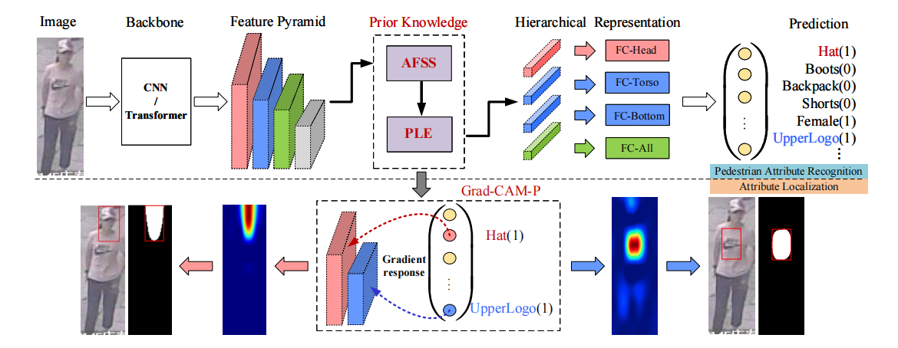

# SSPNet: Scale and Spatial Priors Guided Generalizable and Interpretable Pedestrian Attribute Recognition
This is the PyTorch implementation of the SSPNet.

## Dataset Info
- PA100K [[Paper](http://openaccess.thecvf.com/content_ICCV_2017/papers/Liu_HydraPlus-Net_Attentive_Deep_ICCV_2017_paper.pdf)][[Github](https://github.com/xh-liu/HydraPlus-Net)]
- RAP : A Richly Annotated Dataset for Pedestrian Attribute Recognition 
  - v1 [[Paper](https://arxiv.org/pdf/1603.07054v3.pdf)][[Project](http://www.rapdataset.com/)]
  - v2 [[Paper](https://ieeexplore.ieee.org/abstract/document/8510891)][[Project](http://www.rapdataset.com/)]
- PETA: Pedestrian Attribute Recognition At Far Distance [[Paper](http://mmlab.ie.cuhk.edu.hk/projects/PETA_files/Pedestrian%20Attribute%20Recognition%20At%20Far%20Distance.pdf)][[Project](http://mmlab.ie.cuhk.edu.hk/projects/PETA.html)]
- UPAR [[Paper](https://openaccess.thecvf.com/content/WACV2023/papers/Specker_UPAR_Unified_Pedestrian_Attribute_Recognition_and_Person_Retrieval_WACV_2023_paper.pdf)][[Project](https://github.com/speckean/upar_dataset)]
- Market [[Paper](https://www.cv-foundation.org/openaccess/content_iccv_2015/papers/Zheng_Scalable_Person_Re-Identification_ICCV_2015_paper.pdf](https://www.cv-foundation.org/openaccess/content_iccv_2015/papers/Zheng_Scalable_Person_Re-Identification_ICCV_2015_paper.pdf))]
## Note
- The experimental code is based on Strong Baseline [[Github](https://github.com/valencebond/Rethinking_of_PAR)], thanks to their work! The final performance of the SSPNet model will be affected by how Strong Baseline behaves in your local environment. If you find serious bugs, it is recommended that you run this project file on the original Strong Baseline.
- Directly using intermediate layer features as P1, P2, and P3 will degrade the model performance! If you need more feature maps like P1 and P2, please make sure to use the same up-sampling and smoothing operation. See _upsample_add( ) and smoothx( ) in resnet.py.
- Some suggestions on using human keypoint experiment. The speed of model training is maddening as each image needs to be loaded with specific human keypoint data. It is not recommended to try it unless you are really interested. I'll be experimenting with more efficient human keypoint utilization in my upcoming work, so please stay tuned.
- The code contains some experimental modules not mentioned in the paper, please delete or add them as needed.
- The code is not yet finished, so please give me some time to make it more complete.
